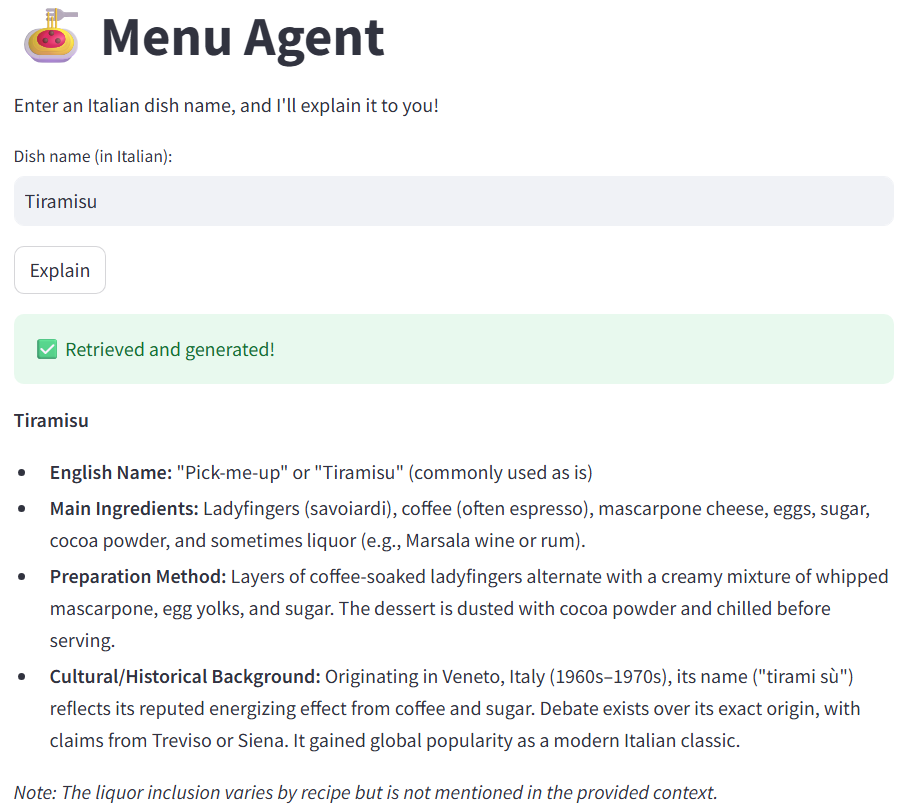

# 🍝 Menu Agent — Italian Dish Explainer

This project is a Retrieval-Augmented Generation (RAG) agent that explains Italian dish names in English. It uses LangChain, FAISS, and Streamlit to provide detailed, context-aware culinary explanations.

---

## 🔍 Features

- 🧠 RAG agent powered by LangChain
- 📖 Supports Italian-to-English dish explanation with ingredients, preparation, and cultural background
- 🔍 FAISS vector search over menu data
- 🌐 Streamlit web interface
- 📊 Judgeval integration for observability and evaluation

---

## 🧾 Prerequisites

### 🔑 API Keys Required

To run this project, you must provide the following API keys:

1. **LLM API Key** — Used to access the language model.  
   *In this project, we use [DeepSeek](https://deepseek.com) as the LLM provider.*

2. **Judgment Labs API Key** — Used for tracing and evaluation via `judgeval`.

You can obtain a Judgment Labs API key by following their official documentation:  
👉 https://docs.judgmentlabs.ai/documentation

Set these API keys directly in the code (`agent.py`), or configure them as environment variables.

---

## 🏗️ Tech Stack

- **LLM**: DeepSeek via OpenAI SDK
- **Embeddings**: `sentence-transformers/all-MiniLM-L6-v2`
- **RAG**: LangChain + FAISS
- **Frontend**: Streamlit
- **Evaluation**: Judgeval Tracer + Evals

---

## 🚀 Getting Started
### 🔑 1. API Keys Required

To run this project, you must provide the following API keys:

1. **LLM API Key** — Used to access the language model.  
   *In this project, I use [DeepSeek](https://deepseek.com) as the LLM provider.*

2. **Judgment Labs API Key** — Used for tracing and evaluation via `judgeval`.

You can obtain a Judgment Labs API key by following their official documentation:  
👉 https://docs.judgmentlabs.ai/documentation

Set these API keys directly in the code (`agent.py`), or configure them as environment variables.


### 2. Install dependencies
```bash
pip install -r requirements.txt
```

### 3. Prepare your data
I’ve only provided a few sample dish entries as examples.
You are free to add your own Italian dish data in the same format in the`menu_data.csv`. 
Example format:

```csv
Italian,English
Spaghetti alla Carbonara,"A Roman pasta dish made with eggs, cheese, pancetta, and black pepper."
```

### 4. Run the app
```bash
streamlit run app.py
```

---

## 🧪 Example



## 📈 Tracing & Evaluation (Optional)

To enable Judgeval tracing and evaluation, refer to the official documentation:  
👉 https://docs.judgmentlabs.ai/documentation
